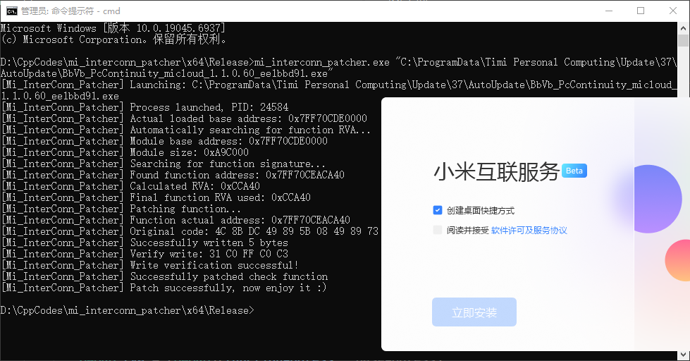

# MiInterconnPatcher

破解补丁，让小米互连服务可以在 Windows 10 上安装。

### Features

------

- 自动根据安装包定位检测函数，自动补丁
- 亦可手动提供检测函数偏移进行补丁

### Usage

------

1. Release下载构建好的补丁或clone源码自行构建

2. 以管理员模式运行命令提示符并定位到补丁路径下

3. 执行 `mi_interconn_patcher.exe 互连服务安装包.exe` （推荐）

   或`mi_interconn_patcher.exe 互连服务安装包.exe 检测函数offset`

